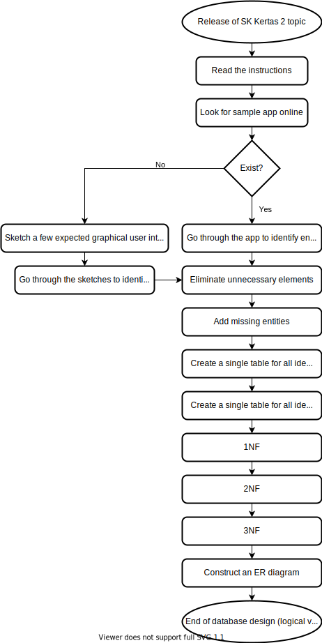

# Designing a Database

## Introduction
TBA (introduce logical level)

## Key Concepts/Glossary
- Entity:
- Relationship:
- Relational model:
  - Table/Relation/File:
  - Column/Attribute/Field:
  - Row/Tuple/Record:
  - Domain:
  - Degree:
  - Cardinality:
  - Key:
    - Primary key:
    - Foreign key

## Overview

## Identifying Requirements

TBA

### Building a Picture

TBA

## Forming a Master Table
TBA

## Normalisation
TBA

## Construction of ER Diagram
TBA
