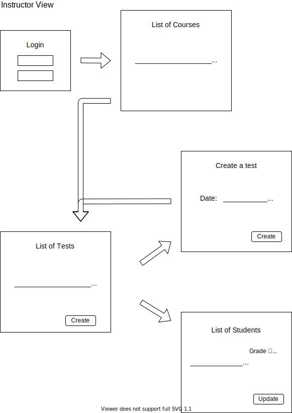
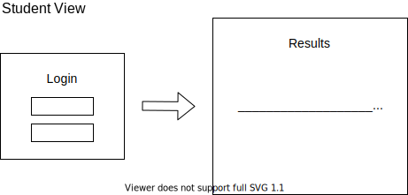
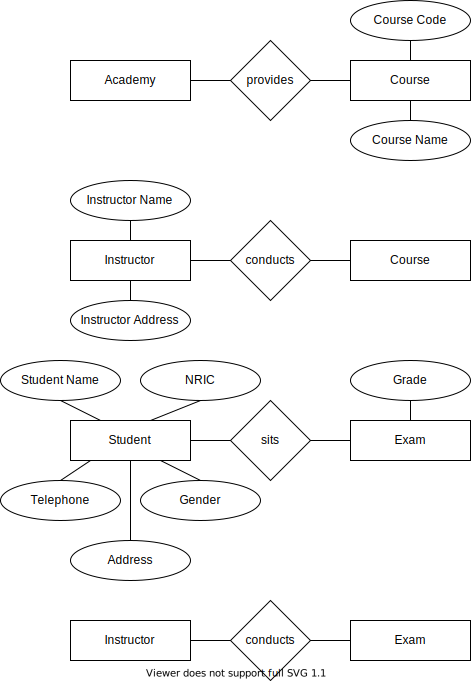
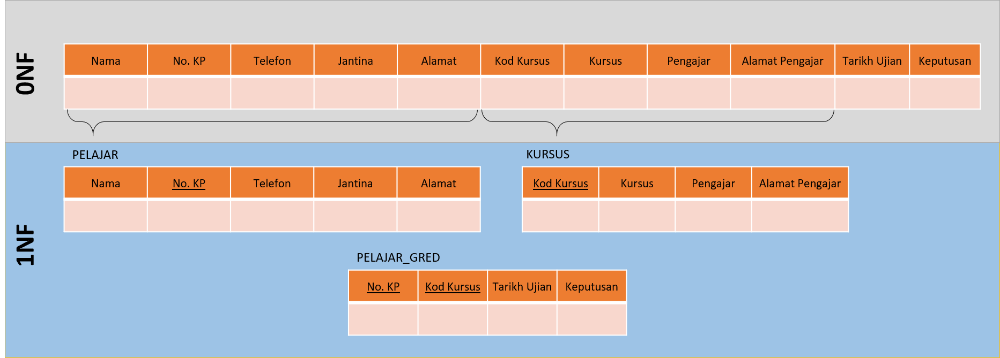
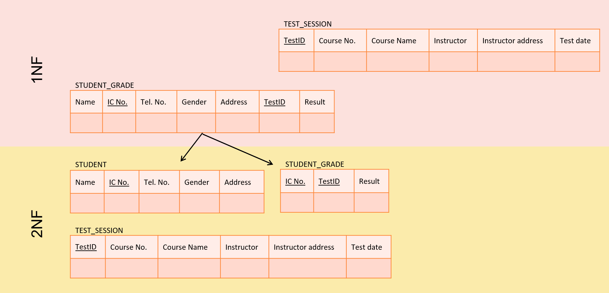
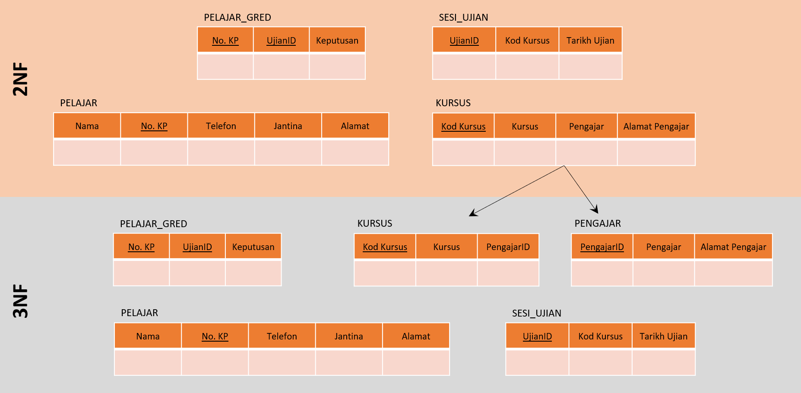
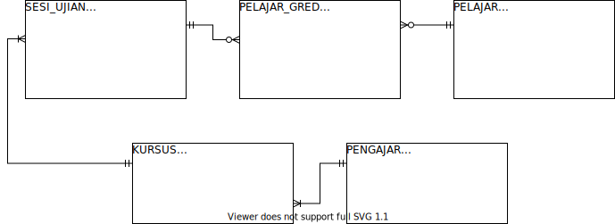

# Designing a Database · *Student’s Handout*

## Identifying Requirements

Based on the instructions, try to sketch the expected webpages your clients would access if they are going to use your system. You shall group your sketches according to use cases.

---

> A DBMS that allows authorised users to store other users' performance grades, and the other users are able to view their grades once available.

<figure>
  
</figure>

<figure>
  
</figure>

Based on the sketches you have made, identify all entities, their attributes and relationships among them. For a better visualisation purpose, construct **an ER model** for **each relationship**.

---

> A skill training academy offers several courses for its students. Students are allowed to take multiple courses at any point of time. The courses are conducted by several external training companies. These training companies, also known as instructors for the courses they are assigned to, hold examinations to assess the performance of their students who enrol to their courses.

Review your ER diagrams. Make sure that the diagrams cover all the requirements listed in the instructions. Make your modification starting from the first step for anything which is unwanted/unnecessary or missed out. You can use the space below for finalising your diagrams.

---

## Forming a Master Table

Create a master table by fitting all identified attributes into the header of the table. Give an appropriate name that best fits the table. Then, create a few records with random data to the table. Despite the word “random”, each record must be sensible and applicable to the use case scenarios. Make sure all the scenarios are covered in the table.

---

<figure>
  
</figure>

## Normalisation

For 1NF: Keep splitting the table until the answers for the following are **absolutely no**.

1.  Do you see **any cell** that contains **multiple value**?
2.  Do you find **any repeating group**?

Give an appropriate name and assign a key (or composite keys) for each table.

---

<figure>
  
</figure>

For 2NF: Continue splitting the table(s) until the answer for the following is **absolutely no**.

1.  Is there any **non-key attribute** which is **independent** of **any of the key attribute(s)** in the same table?

Give an appropriate name and assign a key (or composite keys) for each table.

---

<figure>
  
</figure>

For 3NF: Split the table(s) until the answer for the following is **absolutely no**.

1.  Does any of the **non-key attribute** have a **functional dependency** with another **non-key attribute** in the same table?

Give an appropriate name and assign a key (or composite keys) for each table.

---

<figure>
  
</figure>

## Construct an ER Diagram

Based on your results in 3NF, construct an ER diagram that includes all the tables and cardinalities among them. In order to label the cardinalities correctly, you need to refer to the instructions (where your user requirements originate) and the ER models you have drawn under the ***Identifying Requirements*** section.

Ask yourself these questions when trying to label the cardinality and the connectivity between 2 tables (e.g. Table A and Table B):

1.  For one record in Table A, is it possible to appear in Table B multiple times?
2.  For one record in Table A, is it possible that it will not exist at all in Table B?

The answers correspond to the following notations:

| Q1  | Q2  |           Representation           |     | Q1  | Q2  |           Representation           |
|:---:|:---:|:----------------------------------:|:--- |:---:|:---:|:----------------------------------:|
| Yes | Yes |   |     | No  | No  |   |
| Yes | No  |  |     | No  | Yes |    |

---

Given the conditions below:

> 1.  A student may not necessarily be enrolled in any courses all the time.
> 2.  All courses must have at least one test to assess students' performance.
> 3.  A course can only be taught by an instructor.
> 4.  An instructor must teach at least one course.

The diagram shall look like this:

