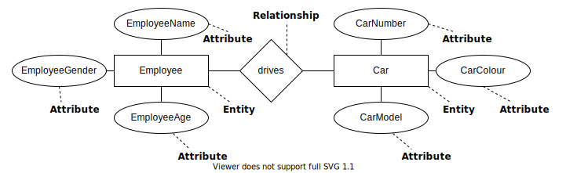

# Setting Up Development Environment

Having a proper system set-up is crucial for software developers in order to produce quality code efficiently. Usually this can be done by installing the Integrated Development Environment (IDE) that supports the programming languages. With the IDE installed the system will have a code editor, a compiler and a debugger.

# IDE for DBMS

**PhpStorm** is an IDE suitable for DBMS development. Eligible users are able to use it for free (see https://www.jetbrains.com/community/education/#students), otherwise it is available as a trialware for 30 days only.

There are other alternative ways to set up DBMS development environment with free software. Follow the sections below to find out more.

*Note: If you are using Windows 10, you may download and run this script to perform the set-up automatically: https://bit.ly/3o4iNKT*

*Note: If you are using Ubuntu or other Debian derivatives, you may download and run this script (with root privilege) to perform the set-up automatically: https://bit.ly/35NHWRP*

## Apache + MySQL + PHP

Apache, MySQL and PHP are three different pieces of software which are commonly used to host web applications over the network. Instead of downloading and installing them separately, they are available in a installer that bundles them so that the installation becomes easier. This bundle, called **XAMPP**, installs Apache (web server), MariaDB (database management system derived from MySQL), PHP (scripting language for web) and Perl (programming language) onto the system.

Learn more on how to set it up on Windows here: https://youtu.be/3B-CnezwEeo?t=112

*Download link: https://www.apachefriends.org/download.html*

## Visual Studio Code

**Visual Studio Code** is a code editor developed by Microsoft. It supports many programming languages through extensions. Developers write their code through this code editor and with the extensions from its built-in marketplace, the editor can automatically format the code with syntax highlighting and code linting for better readability. Some would even provide certain level of debugging features, which turns it into an IDE.

*Download link: https://code.visualstudio.com/*

## Git

**Git** is a free version control system that helps developers to manage revisions of their development work. That means Git allows developers to revert changes if earlier snapshots of the work were saved in the past. It also allows developers to develop their project in different branches so that it will not introduce unfinalised work to the production branch.

*Download link: https://git-scm.com/downloads*

